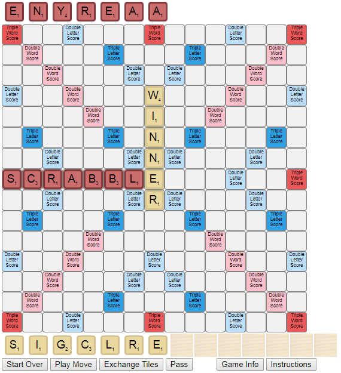
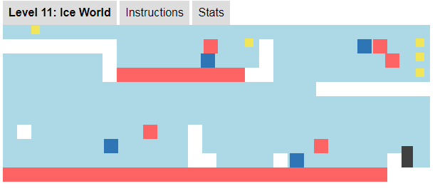

## Daniel M. Cheng
### Projects 
1. [Automated Drone Photo Service](#automated-drone-photo-service)
2. [Scrabble AI (Greedy Search Algorithm)](#scrabble-ai)
3. [Obstruct.io: A Javascript Game](#obstruct-io-a-javascript-game)
4. [ETL Utility Library Suite](#utility-library-suite-for-etls-and-qcs-in-sas)

### In Progress 
* [Abstract Syntax Tree](#abstract-syntax-tree)
* [Virtual Therapist](#irtual-therapist)


## Automated Drone Photo Service 
I built [Numerate.io](http://ec2-52-11-200-166.us-west-2.compute.amazonaws.com:5000/photos), a complete automated drone photo service to count cars and people. Users of this service can request photos in two ways:
1. Send a text message to trigger the drone to start its mission 
2. Schedule the drone to fly every 10 minutes over the same area each day 

[VIDEO]

In terms of architecture, I built a custom Android app to automate mission control of the drone (via [DJI's mobile SDK](https://developer.dji.com/mobile-sdk/)). This then compresses and pushes the photos to the hosting AWS EC2. Python then stitches and cleans the photos using [Hugin](https://wiki.panotools.org/Hugin_executor) and [OpenCV](https://opencv.org/), before posting to the [Flask-hosted website](http://ec2-52-11-200-166.us-west-2.compute.amazonaws.com:5000/photos). I completed the entire build in 2 weeks. 

### Technical Challenges: Multithreading and Synchronization 
One significant technical challenge was in troubleshooting multithreading issues with limited download bandwidth. This problem arose because originally, in transferring photos from the drone to AWS, I allowed the DJI SDK to continually download as many photos in parallel as possible. However, after 5 or more photos, the SDK quickly ran out of bandwidth and failed to download any remaining photos. 

To solve this, I first maintained a queue of photos to order downloads one by one. Secondly, I implemented a mutex to prevent multiple callbacks from executing in parallel. While this slowed down the download process, this solution guaranteed reliability, a far more valuable feature for this drone service. 

Read through my [drone writeup](https://github.com/danielmcheng1/drone/blob/master/writeup.md) to learn more about these technical challenges, as well as softer project skills (defining user requirements and completing an MVP) and the overall software architecture. 

## Scrabble AI
I built a [complete Scrabble application](http://ec2-52-11-200-166.us-west-2.compute.amazonaws.com:8000/login) implementing the following features:
1. AI running greedy backtracking algorithm to search for the optimal tile placement 
2. Complete game logic for validating and scoring human moves

The entire move algorithm was built from scratch based on the data structures explained in [Appel & Jacobson's research paper](https://www.cs.cmu.edu/afs/cs/academic/class/15451-s06/www/lectures/scrabble.pdf). They optimize the search for valid Scrabble placements through three techniques:
1. __Space-Efficient Data Structure__: Load the lexicon into a DAWG (directed acyclic word graph), essentially a trie with all common suffixes merged
2. __Precompute Constraints__: Precompute all hook spots and crossword letters to reduce branching factor 
3. __Backtracking__: Prune your search by terminating as early in the prefix as possible 

I further sped up search performance by converting Appel & Jacobson's DAWG structure into the GADDAG proposed by [Steven A. Gordon](http://ericsink.com/downloads/faster-scrabble-gordon.pdf). Since Scrabble tiles must "hook" onto existing tiles (i.e. at least one tile must be adjacent to an existing tile on the board), the GADDAG stores every reversed prefix of every word. 

For example, in a regular trie, the word "ORANGE" would be traced exactly once. But in a GADDAG, "ORANGE" would appear six times:
```python
O+RANGE
RO+ANGE
ARO+NGE
NARO+GE
GNARO+E
EGNARO+
```
As an example, take the second representation, "RO+ANGE". Given a starting hook spot, you would first place "R", then move _left_ and place "O". Hence you are generating the prefix--_in reverse_ from the hook spot. So, upon encountering the "+" symbol, you now switch from prefix generation to suffix generation. You place "A" one spot to the right of the hook spot, then "N", "G", and "E". Thus the GADDAG structure makes the search for prefixes deterministic: branches are searched only if the first letter can hook onto the board. 

Hence, using a GADDAG applies the classic tradeoff of space for time: the GADDAG is nearly five times larger than the DAWG, but generates moves twice as fast.

Please read my [Scrabble AI writeup]() for further details on this GADDAG search algorithm, as well as precomputing constraints and backtracking, .

Want to test your own lexical skills against the Scrabble AI? Click [here]((http://ec2-52-11-200-166.us-west-2.compute.amazonaws.com:8000/login) to begin play.

        

## Obstruct.io: A Javascript Game 
Obstruct.io is a full-fledged animated web game complete with levels, sound effects, and game stats. This was a small side project for gaining experience building a fully functional product from start to finish. I completed the build for this in a week (subsequent revisions were primarily with tweaking and adding new levels). 

I based the initial prototype off of the [Eloquent Javascript tutorial](eloquentjavascript.net/15_game.html), before adding my own custom advanced features, including the ability to shoot water, to explode bombs, and to move on floating ice blocks.

 

In terms of applicability to software engineering, this build hit on three core CS concepts:
1. __Scope__: Establish scope properly based on the need to share between methods, to maintain readable code, and to prevent unintended side effects. This was particularly important in building this game in determining how to transmit information between levels  
2. __Serialization__: Convert an object state into byte stream for transmission. In this game, I serialized the game state to enable the player to restart at the last checkpoint. Saving state is crucial for transmitting data across points in time and across different database systems.
3. __Asynchronous Callbacks__: Pass code to be executed on a separate thread at a later point in time. In this game, callbacks enabled interactivity--e.g. "When I click on this button, run this animation" 

Click [here](https://danielmcheng1.github.io/obstructio/obstructio.html) to see if you can beat all 16 levels in this game.

## Utility Library Suite for ETLs and QCs in SAS 
I wrote a [suite of SAS utilities](https://github.com/danielmcheng1/SAS) to support the following needs:
* __Comparison__: How do two datasets differ by key? What sequence of update, delete, and insert commands will transform one dataset into the other? 
* __Assertion__: Validate standard dataset checks such as uniqueness check and null check 
* __Type Conversion__: Convert correctly and quickly between different data types to allow for proper joins and comparisons 
* __ETL Performance__: Speed up daily loads by selecting the optimal algorithm for the given datasets (e.g. hash lookup vs. binary search)

Building this library suite required me to properly define an API for each utility. The calling client does not have to know the implementation within my code base, but my code has to reliably fulfill the terms of the API contract, with both the input parameters and output result.

Furthermore, any production code must also be properly documented and thoroughly tested. My [repository](https://github.com/danielmcheng1/SAS) provides thorough documentation as well as a supplemental set of unit tests on each utility. 

## Abstract Syntax Tree
I built an initial prototype (using regex/string matching) to parse the SAS programming language. Aside from being a theoretical curiosity and software exercise, this parser also enabled automatic identification of dataset dependencies within and between SAS codes executed in weekly ETLs. 

I am currently working to rebuild this using [ANTLR](http://www.antlr.org/). After defining a grammar, I will use ANTLR to create a lexer and parser, ultimately generating an abstract syntax tree. After that, it would be a straightforward exercise to use a listener or visitor to walk down the abstract syntax tree and identify datasets and dependencies. This would then be transformed into a front-end interface for users to quickly drilldown into their code structure. 

SCREENSHOT 

## Virtual Therapist
I built a WebSocket interface for users to speak to a virtual AI therapist. I used Python to drive the backend logic, first calling the NLTK chat modules, before adding in additional emotion identifiers based on [indico's emotion recognition API](https://indico.io/docs).  


Training a bot to recognize emotions is of particular interest to me, particularly with this latest "Emotional Chatting Machine" blurring the boundary between human and robot (see [_The Guardian_ news briefing](https://www.theguardian.com/technology/2017/may/05/human-robot-interactions-take-step-forward-with-emotional-chatting-machine-chatbot) and the latest [research](https://arxiv.org/abs/1704.01074) on this frontier). I'd like to improve this bot to blend more sophisticated emotion APIs, and ultimately apply this towards enhancing psychotherapy. [Several companies](https://www.wired.com/2017/06/facebook-messenger-woebot-chatbot-therapist/) have already started to apply this. 

You can chat with the AI therapist yourself at the following [link](http://danielmcheng1-therapist.herokuapp.com/). I included two additional bots (Olga and Ana) purely as entertainment to contrast their personalities with the actual AI therapist (Eliana).

This bot is hosted on Heroku, using Flask-SocketIO to transmit chat messages between human user and AI therapist. 
