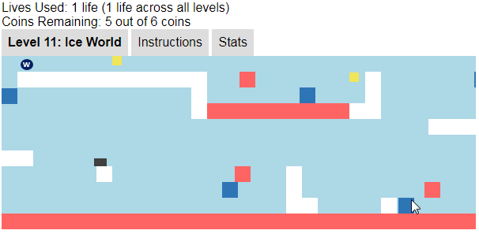

## Daniel M. Cheng
### Completed Projects 
1. [Automated Drone Photo Service](#automated-drone-photo-service)
2. [Scrabble AI (Greedy Search Algorithm)](#scrabble-ai)
3. [Obstruct.io: A Javascript Game](#obstruct-io-a-javascript-game)
4. [ETL Utility Library Suite](#utility-library-suite-for-etls-and-qcs-in-sas)

### In Progress 
* [Abstract Syntax Tree](#abstract-syntax-tree)
* [Virtual AI Therapist](#virtual-ai-therapist)

## Automated Drone Photo Service 
[Numerate.io](http://ec2-52-11-200-166.us-west-2.compute.amazonaws.com:5000/photos) is a completely automated drone photo service to count cars (to save time circling parking lots) and people (to save time waiting at the carpool).
Users of this service can request photos in two ways:
1. Send a text message to trigger the drone to start its mission 
2. Schedule the drone to fly every 10 minutes over the same area each day 

[VIDEO]

This service has two parts: 
1. A custom Android app that automates mission control of the drone DJI's mobile SDK. And then compresses and pushes the photos to the backend.
2. AWS-hosted backend that stitches and cleans photos using [OpenCV](https://opencv.org/) before displaying on Flask Website in realtime

**[Click here to visit numerate.io](http://ec2-52-11-200-166.us-west-2.compute.amazonaws.com:5000/photos)** to see photos collected by previous drone missions.

### Technical Challenges: Multithreading and Synchronization 
A significant challenge was in troubleshooting why realtime downloads of image would stop after 5 or more photos. After digging deep into the code I found out that triggering a download as soon as each photo is taken very quickly saturates the limited radio bandwidth and leads to dropped packets that corrupt the jpgs.

The naive solution here is to add photos to a queue and download them in sequence. However, because the download method is asynchronous, it instantly returns; hence sequentially processing the queue leads to the same bandwidth saturating behavior as before.

To solve this, I first maintained a queue of photos. I then implemented a lock to prevent a second download from running as long as one photo is downloading. While this slowed down the download process, this solution guaranteed reliability, a far more valuable feature for this drone service. 

**[Read through my drone writeup](https://github.com/danielmcheng1/drone/blob/master/writeup.md)** to learn more about these technical challenges, how I defined the MVP, broke down the tasks, estimated the time required for each, and adapted as that plan changed during the course of this project.

## Scrabble AI
I built a [complete Scrabble application](http://ec2-52-11-200-166.us-west-2.compute.amazonaws.com:8000/login) where players can play against the computer. The two main features are:
1. AI running greedy backtracking algorithm to search for the optimal tile placement 
2. Complete game logic for validating and scoring human moves

The entire move algorithm was built from scratch based on the data structures explained in Appel & Jacobson's research paper. They optimize the search for valid Scrabble placements through three techniques:
1. __Space-Efficient Data Structure__: Load the lexicon into a DAWG (directed acyclic word graph), essentially a trie with all common suffixes merged
2. __Precompute Constraints__: Precompute all hook spots and crossword letters to reduce branching factor 
3. __Backtracking__: Prune your search by terminating as early in the prefix as possible 

I further sped up search performance by converting Appel & Jacobson's DAWG structure into the GADDAG proposed by Steven A. Gordon. Since placed tiles must "hook" onto existing tiles, the GADDAG stores every reversed prefix of every word, so that the recursive search algorithm can build deterministically from each hook spot. Hence using a GADDAG applies the classic tradeoff of space for time: the GADDAG is nearly five times larger than the DAWG, but generates moves twice as fast.

Please read my [Scrabble AI writeup]() for further details on this GADDAG search algorithm.

**[Click here to begin playing Scrabble.](http://ec2-52-11-200-166.us-west-2.compute.amazonaws.com:8000/login)**

        

## Obstruct.io: A Javascript Game 
Obstruct.io is a full-fledged game complete with user editable levels. This project allowed me to gain experience in building a fully functional product from start to finish.

I started off with a simple prototype where the objective was to jump over obstacles and avoid lava. I then added advanced features like shooting water to destroy lava blocks, destroying obstacles using bombs, and jumping on floating ice blocks to pass over lava. I also built simple killer bots that honed in to attack wherever the player was.

 
 

I strove towards clean code by:
1. __Scoping__: I scoped down variables to maintain readable code and to prevent unintended side effects. This was particularly important in transmitting information between levels--a key requirement of this game.
2. __Serialization__: I converted an object state into byte stream for transmission. This allows restarting at the last checkpoint.
3. __Asynchronous Callbacks__: Callbacks enable interactivity in the game e.g. "When I click on this button, run this animation" 

**[Click here to see if you can beat all 16 levels in this very fun game.](https://danielmcheng1.github.io/obstructio/obstructio.html)** Be sure to use your headphones!

## Library of SAS utilities for ETLs and QC
I wrote a [library of SAS utilities](https://github.com/danielmcheng1/SAS) to:
* __Calculate Transformation Sequence__: How do two datasets differ? What sequence of update, delete, and insert commands will transform one dataset into the other? 
* __Perform Validation__: Validate standard checks such as uniqueness check and null check 
* __Perform Type Conversion__: Convert correctly and quickly between different data types to allow proper joins and comparisons 
* __Optimize ETL Performance__: Speed up daily loads by selecting the optimal algorithm for the given datasets (e.g. hash lookup vs. binary search)

Building this library required me to properly define an API for each utility. The calling client does not have to know the implementation within my code base, but my code has to reliably fulfill the terms of the API contract for a wide variety of input parameters.

Furthermore, any production code must also be properly documented and thoroughly tested. My [repository](https://github.com/danielmcheng1/SAS) provides thorough documentation as well as unit tests for each utility. 

## SAS Parser to identify dataset dependencies
I built an initial prototype (using regex/string matching) to parse the SAS programming language. Aside from being a theoretical curiosity and software exercise, this parser also enabled automatic identification of dataset dependencies within SAS codes executed in daily ETLs. 

This allowed one to identify which input data sets affected which output data sets in a piece of SAS code. So for instance, if you discovered an error in one input data set and wanted to change it, you would be able to quickly tell what output datasets would be affected.

I am currently working to rebuild this using [ANTLR](http://www.antlr.org/). After defining a grammar, I will use ANTLR to create a lexer and parser, ultimately generating an abstract syntax tree. After that, it would be a straightforward exercise to use a listener or visitor to walk down the abstract syntax tree and identify datasets and dependencies. This would then be transformed into a front-end interface for users to quickly drilldown into their code structure. 

SCREENSHOT 

## Virtual AI Therapist
I built a Facebook Messenger-like Javascript widget for users to speak to multiple virtual AI therapists. The backend is in Python. It uses the Python Natural Languate Tool Kit (NLTK) chat modules, then calls out to indico's emotion recognition API to tag emotions in the user's message. This allows the AI therapist to be more empathic in the response it generates.

Training a bot to recognize emotions is of particular interest to me, particularly with this latest "Emotional Chatting Machine" blurring the boundary between human and robot (see [_The Guardian_ news briefing](https://www.theguardian.com/technology/2017/may/05/human-robot-interactions-take-step-forward-with-emotional-chatting-machine-chatbot)). I'd like to improve this bot to blend more sophisticated emotion APIs, and ultimately apply this towards enhancing psychotherapy. Several companies have already started doing this. 

**[You can chat with the AI therapist here](http://danielmcheng1-therapist.herokuapp.com/)**. I included two additional bots (Olga and Ana) purely as entertainment to contrast their personalities with the actual AI therapist (Eliana).

This bot is hosted on Heroku, using Flask-SocketIO to transmit messages between user and AI therapist. 